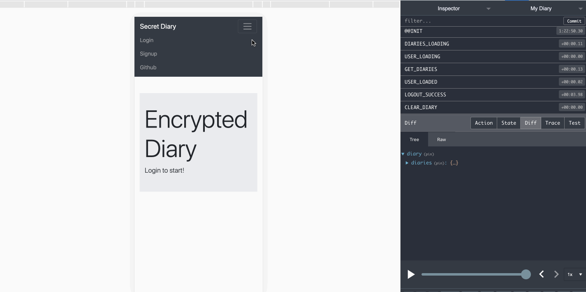

# Secret Dairy

This is a simply diary built with MongoDB, Express.js, React.js and Node.js, styled with Reactstrap, and backed with Redux, rich text editor, and CI/CD pipeline.
The site is deployed via Heroku at: https://secret-diary.herokuapp.com.

I wrote the site to practice the MERN stack and Redux. All functions are stored in Redux. This app is responsive.

## Directory Layout

- `client`: React application
- `middleware`: JWT config
- `model`: Diary and User models
- `routes`: server side routes

DEMO:

## Access Control

- User can only view diary list after login.
- User can only view, edit and delete diaries after providing correct secret to that diary.

## Encryption

- Diaries' contents are encrypted in browser with secret key provided by user.
- User needs to provide secret to decode a diary. The secret will be saved in Redux until logout.
- Redux only stores one pair of { diary.id: secret}.
- Traffic are secured with HTTPS.

## CI/CD pipeline

- I used TravisCI to build a Docker container to run ESLint before deploying via Heroku.

## Potential Improvements

- Encrypt database (not free on MongoDB. I probably should have used PostgresQL)
- Better error catching
